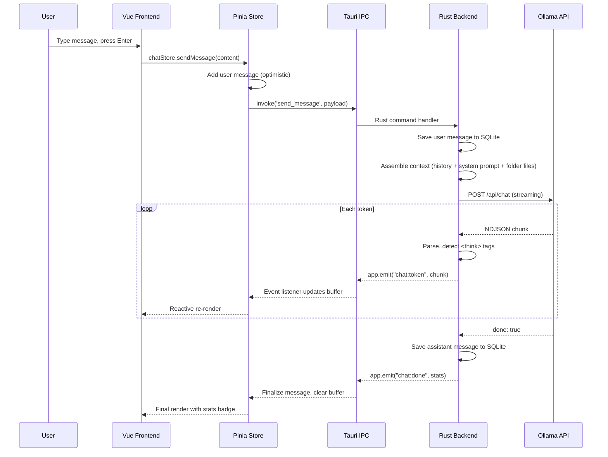
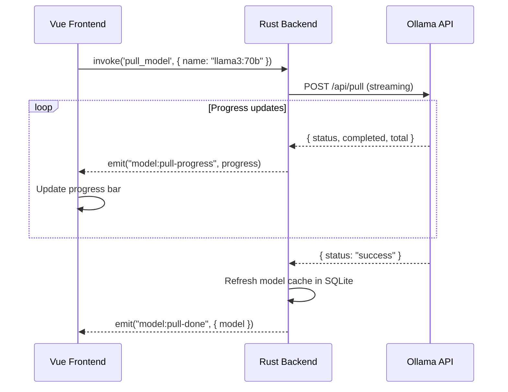
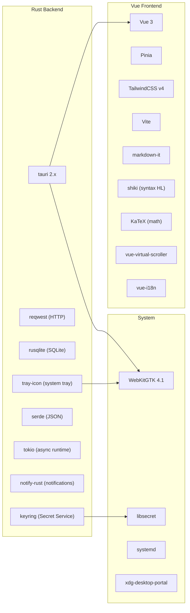

# Ollama Desktop — Architecture Document

> **v1.0** — 2026-03-25
> Companion to [PRODUCT_SPEC.md](file:///home/nikoteressi/ollama-desktop/PRODUCT_SPEC.md)

---

## 1. High-Level Architecture

```
┌─────────────────────────────────────────────────────────────┐
│                    TAURI v2 PROCESS                         │
│                                                             │
│  ┌───────────────────────┐    ┌──────────────────────────┐  │
│  │   Vue 3 Frontend      │    │   Rust Backend           │  │
│  │   (WebKitGTK WebView) │◄──►│   (Tauri Commands)       │  │
│  │                       │IPC │                          │  │
│  │  ┌─────────────────┐  │    │  ┌────────────────────┐  │  │
│  │  │ Pinia Stores    │  │    │  │ Chat Engine        │  │  │
│  │  │ • chat          │  │    │  │ • stream mgmt      │  │  │
│  │  │ • models        │  │    │  │ • context assembly  │  │  │
│  │  │ • settings      │  │    │  ├────────────────────┤  │  │
│  │  │ • hosts         │  │    │  │ Model Manager      │  │  │
│  │  │ • ui            │  │    │  │ • pull/delete/list  │  │  │
│  │  └─────────────────┘  │    │  ├────────────────────┤  │  │
│  │                       │    │  │ Host Manager       │  │  │
│  │  ┌─────────────────┐  │    │  │ • multi-endpoint   │  │  │
│  │  │ Components      │  │    │  ├────────────────────┤  │  │
│  │  │ • ChatView      │  │    │  │ Auth Manager       │  │  │
│  │  │ • ModelBrowser   │  │    │  │ • OAuth / API key  │  │  │
│  │  │ • SettingsPanel  │  │    │  ├────────────────────┤  │  │
│  │  │ • HostSelector   │  │    │  │ Settings Manager   │  │  │
│  │  │ • ThinkBlock     │  │    │  ├────────────────────┤  │  │
│  │  └─────────────────┘  │    │  │ Folder Context Mgr │  │  │
│  └───────────────────────┘    │  ├────────────────────┤  │  │
│                               │  │ Service Manager    │  │  │
│                               │  │ (systemctl)        │  │  │
│                               │  └────────────────────┘  │  │
│                               │                          │  │
│                               │  ┌────────────────────┐  │  │
│                               │  │ Shared Services    │  │  │
│                               │  │ • SQLite (rusqlite)│  │  │
│                               │  │ • Keyring (Secret  │  │  │
│                               │  │   Service API)     │  │  │
│                               │  │ • System Tray      │  │  │
│                               │  │ • Notifications    │  │  │
│                               │  └────────────────────┘  │  │
│                               └──────────────────────────┘  │
└─────────────────────────────────────────────────────────────┘
         │                              │
         ▼                              ▼
  ┌──────────────┐            ┌──────────────────┐
  │ Static Assets│            │ Ollama Hosts     │
  │ (Vite build) │            │ • localhost:11434│
  └──────────────┘            │ • LAN servers    │
                              │ • Ollama Cloud   │
                              └──────────────────┘
```

### Architectural Style: **Modular Monolith (Desktop)**

A single-process Tauri app with clean module boundaries in Rust. No microservices — this is a desktop application. Modules communicate through shared state and function calls within the Rust backend. The frontend is a single Vue 3 SPA rendered in WebKitGTK.

---

## 2. Project Structure

```
ollama-desktop/
├── src-tauri/                    # Rust backend (Tauri)
│   ├── Cargo.toml
│   ├── tauri.conf.json           # Tauri v2 configuration
│   ├── capabilities/             # Tauri v2 permission capabilities
│   │   └── default.json
│   ├── icons/
│   └── src/
│       ├── main.rs               # Entry point, app builder
│       ├── lib.rs                # Module declarations
│       ├── commands/             # Tauri IPC command handlers
│       │   ├── mod.rs
│       │   ├── chat.rs           # Chat CRUD, send message, stop
│       │   ├── models.rs         # List, pull, delete, show models
│       │   ├── hosts.rs          # CRUD hosts, ping, switch active
│       │   ├── settings.rs       # Get/set settings
│       │   ├── auth.rs           # Login, logout, API key mgmt
│       │   ├── folders.rs        # Link/unlink folder context
│       │   └── service.rs        # Start/stop ollama systemd service
│       ├── ollama/               # Ollama API client
│       │   ├── mod.rs
│       │   ├── client.rs         # HTTP client (reqwest), host routing
│       │   ├── streaming.rs      # SSE stream parsing, token emission
│       │   └── types.rs          # API request/response types
│       ├── db/                   # SQLite persistence layer
│       │   ├── mod.rs
│       │   ├── migrations.rs     # Schema migrations
│       │   ├── conversations.rs  # Conversation CRUD
│       │   ├── messages.rs       # Message CRUD
│       │   ├── hosts.rs          # Host CRUD
│       │   ├── settings.rs       # Settings KV store
│       │   └── folders.rs        # Folder context records
│       ├── auth/                 # Authentication logic
│       │   ├── mod.rs
│       │   ├── keyring.rs        # Secret Service API wrapper
│       │   └── oauth.rs          # OAuth flow (ollama.com)
│       ├── system/               # OS integration
│       │   ├── mod.rs
│       │   ├── tray.rs           # System tray setup
│       │   ├── notifications.rs  # Desktop notifications
│       │   └── systemd.rs        # systemctl commands
│       ├── state.rs              # AppState (shared across commands)
│       └── error.rs              # Unified error types
│
├── src/                          # Vue 3 frontend
│   ├── main.ts                   # App entry, Pinia init, router
│   ├── App.vue                   # Root component
│   ├── stores/                   # Pinia state management
│   │   ├── chat.ts               # Conversations, messages, streaming
│   │   ├── models.ts             # Model list, pull progress
│   │   ├── hosts.ts              # Host list, active host, health
│   │   ├── settings.ts           # User preferences
│   │   ├── auth.ts               # Auth state, user profile
│   │   └── ui.ts                 # Sidebar, theme, compact mode
│   ├── composables/              # Vue 3 composition functions
│   │   ├── useStreaming.ts       # Token stream listener
│   │   ├── useAutoScroll.ts      # Smart scroll-lock behavior
│   │   ├── useKeyboard.ts       # Global keyboard shortcuts
│   │   └── useTheme.ts          # Dark/light mode management
│   ├── components/
│   │   ├── chat/
│   │   │   ├── ChatView.vue      # Main chat area
│   │   │   ├── MessageBubble.vue # Single message rendering
│   │   │   ├── ThinkBlock.vue    # Collapsible reasoning panel
│   │   │   ├── CodeBlock.vue     # Syntax-highlighted code
│   │   │   ├── ChatInput.vue     # Message input + attachments
│   │   │   └── StreamIndicator.vue
│   │   ├── sidebar/
│   │   │   ├── Sidebar.vue
│   │   │   └── ConversationList.vue
│   │   ├── models/
│   │   │   ├── ModelBrowser.vue
│   │   │   └── ModelCard.vue
│   │   ├── hosts/
│   │   │   └── HostManager.vue
│   │   ├── settings/
│   │   │   └── SettingsPanel.vue
│   │   └── shared/
│   │       ├── TopBar.vue
│   │       └── ErrorScreen.vue   # Connection error (§3.7)
│   ├── views/
│   │   ├── ChatPage.vue
│   │   ├── ModelsPage.vue
│   │   └── SettingsPage.vue
│   ├── lib/
│   │   ├── tauri.ts              # Typed wrappers around invoke()
│   │   ├── markdown.ts           # markdown-it + shiki + katex setup
│   │   └── constants.ts
│   ├── assets/
│   │   └── styles/
│   │       └── main.css          # TailwindCSS v4 entry
│   └── types/                    # Shared TypeScript types
│       ├── chat.ts
│       ├── models.ts
│       ├── hosts.ts
│       └── settings.ts
│
├── index.html
├── vite.config.ts
├── tailwind.config.ts
├── tsconfig.json
├── package.json
├── PRODUCT_SPEC.md
└── ARCHITECTURE.md               # This file
```

---

## 3. Rust Backend — Tauri Commands

All IPC between frontend and backend uses Tauri v2's `#[tauri::command]` system. Commands are async and return `Result<T, AppError>`.

### 3.1 Command Registry

```rust
// src-tauri/src/main.rs
fn main() {
    tauri::Builder::default()
        .manage(AppState::new())
        .invoke_handler(tauri::generate_handler![
            // Chat
            commands::chat::list_conversations,
            commands::chat::get_conversation,
            commands::chat::create_conversation,
            commands::chat::delete_conversation,
            commands::chat::rename_conversation,
            commands::chat::pin_conversation,
            commands::chat::send_message,        // triggers streaming
            commands::chat::stop_generation,
            commands::chat::export_conversation,
            commands::chat::search_conversations,
            // Models
            commands::models::list_models,
            commands::models::show_model,
            commands::models::pull_model,         // triggers progress events
            commands::models::delete_model,
            commands::models::create_model,
            commands::models::search_library,
            // Hosts
            commands::hosts::list_hosts,
            commands::hosts::add_host,
            commands::hosts::update_host,
            commands::hosts::delete_host,
            commands::hosts::set_active_host,
            commands::hosts::ping_host,
            // Settings
            commands::settings::get_settings,
            commands::settings::set_setting,
            commands::settings::get_all_settings,
            // Auth
            commands::auth::login,
            commands::auth::logout,
            commands::auth::get_auth_status,
            commands::auth::create_api_key,
            commands::auth::revoke_api_key,
            commands::auth::list_api_keys,
            // Folder Context
            commands::folders::link_folder,
            commands::folders::unlink_folder,
            commands::folders::list_folder_files,
            commands::folders::update_included_files,
            commands::folders::estimate_tokens,
            // Service
            commands::service::start_ollama,
            commands::service::stop_ollama,
            commands::service::ollama_service_status,
        ])
        .setup(|app| {
            // Initialize SQLite, run migrations
            // Start system tray
            // Start background host health pinger
            Ok(())
        })
        .run(tauri::generate_context!())
        .expect("error running app");
}
```

### 3.2 Shared Application State

```rust
// src-tauri/src/state.rs
use rusqlite::Connection;
use std::sync::Mutex;
use tokio::sync::broadcast;

pub struct AppState {
    pub db: Mutex<Connection>,             // SQLite (WAL mode)
    pub active_host: Mutex<Host>,          // Currently selected Ollama endpoint
    pub cancel_tx: Mutex<Option<broadcast::Sender<()>>>,  // Stop generation signal
    pub http_client: reqwest::Client,      // Shared HTTP client (connection pooling)
}
```

### 3.3 Key Command Signatures

```rust
// --- Chat ---
#[tauri::command]
async fn send_message(
    state: State<'_, AppState>,
    app: AppHandle,
    conversation_id: String,
    content: String,
    images: Option<Vec<Vec<u8>>>,
    model: String,
    options: ChatOptions,          // temperature, top_p, num_ctx, etc.
) -> Result<(), AppError>;
// Streams tokens via Tauri events (see §4)

#[tauri::command]
async fn stop_generation(
    state: State<'_, AppState>,
) -> Result<(), AppError>;
// Sends cancel signal via broadcast channel

// --- Models ---
#[tauri::command]
async fn pull_model(
    state: State<'_, AppState>,
    app: AppHandle,
    model_name: String,
) -> Result<(), AppError>;
// Streams progress via Tauri events

// --- Hosts ---
#[tauri::command]
async fn ping_host(
    state: State<'_, AppState>,
    host_id: String,
) -> Result<HostStatus, AppError>;
// Calls GET /api/tags on the host, returns online/offline + latency

// --- Auth ---
#[tauri::command]
async fn login(
    state: State<'_, AppState>,
    method: AuthMethod,  // OAuth or ApiKey
    credential: String,
) -> Result<UserProfile, AppError>;
// Stores token in system keyring via Secret Service API
```

---

## 4. Tauri Event System — Streaming Architecture

The most critical architectural decision: **how tokens flow from Ollama → Rust → Vue**.

### 4.1 Event Flow

```
Ollama API ──(SSE/NDJSON)──► Rust (reqwest stream)
                                    │
                          parse each chunk
                                    │
                          ┌─────────▼──────────┐
                          │ app.emit("chat:    │
                          │   token", payload)  │
                          └─────────┬──────────┘
                                    │
                          Tauri event bus
                                    │
                          ┌─────────▼──────────┐
                          │ Vue: listen("chat: │
                          │   token", handler)  │
                          └─────────┬──────────┘
                                    │
                          Pinia store update
                                    │
                          Vue reactivity → DOM
```

### 4.2 Event Catalog

| Event Name | Direction | Payload | Purpose |
|---|---|---|---|
| `chat:token` | Rust → Vue | `{ conversation_id, content, done: false }` | Single token/chunk during generation |
| `chat:done` | Rust → Vue | `{ conversation_id, total_tokens, duration_ms, tokens_per_sec }` | Generation complete |
| `chat:error` | Rust → Vue | `{ conversation_id, error: string }` | Stream error |
| `chat:thinking-start` | Rust → Vue | `{ conversation_id }` | `<think>` tag detected |
| `chat:thinking-end` | Rust → Vue | `{ conversation_id }` | `</think>` tag detected |
| `model:pull-progress` | Rust → Vue | `{ model, status, completed, total, percent }` | Download progress |
| `model:pull-done` | Rust → Vue | `{ model }` | Download complete |
| `host:status-change` | Rust → Vue | `{ host_id, status, latency_ms }` | Periodic health check result |

### 4.3 Rust Streaming Implementation

```rust
// src-tauri/src/ollama/streaming.rs
use futures_util::StreamExt;
use tauri::{AppHandle, Emitter};

pub async fn stream_chat(
    app: &AppHandle,
    client: &reqwest::Client,
    url: &str,
    request: ChatRequest,
    conversation_id: &str,
    cancel_rx: tokio::sync::broadcast::Receiver<()>,
) -> Result<(), AppError> {
    let response = client.post(url).json(&request).send().await?;
    let mut stream = response.bytes_stream();
    let mut cancel_rx = cancel_rx;
    let mut in_think_block = false;

    loop {
        tokio::select! {
            // Cancel signal from user
            _ = cancel_rx.recv() => {
                break;
            }
            // Next chunk from Ollama
            chunk = stream.next() => {
                match chunk {
                    Some(Ok(bytes)) => {
                        let data: StreamResponse = serde_json::from_slice(&bytes)?;

                        // Detect <think> blocks for special UI rendering
                        if data.message.content.contains("<think>") && !in_think_block {
                            in_think_block = true;
                            app.emit("chat:thinking-start",
                                json!({ "conversation_id": conversation_id }))?;
                        }
                        if data.message.content.contains("</think>") && in_think_block {
                            in_think_block = false;
                            app.emit("chat:thinking-end",
                                json!({ "conversation_id": conversation_id }))?;
                        }

                        // Emit token
                        app.emit("chat:token", json!({
                            "conversation_id": conversation_id,
                            "content": data.message.content,
                            "done": data.done,
                        }))?;

                        if data.done {
                            app.emit("chat:done", json!({
                                "conversation_id": conversation_id,
                                "total_tokens": data.eval_count,
                                "duration_ms": data.total_duration / 1_000_000,
                                "tokens_per_sec": data.eval_count as f64
                                    / (data.eval_duration as f64 / 1e9),
                            }))?;
                            break;
                        }
                    }
                    Some(Err(e)) => {
                        app.emit("chat:error", json!({
                            "conversation_id": conversation_id,
                            "error": e.to_string(),
                        }))?;
                        break;
                    }
                    None => break,
                }
            }
        }
    }
    Ok(())
}
```

### 4.4 Why Tauri Events over WebSockets/SSE

| Approach | Verdict | Reasoning |
|---|---|---|
| **Tauri Events** ✅ | **Chosen** | Native IPC, zero overhead, type-safe, built-in to Tauri v2; no port binding or CORS; works through `app.emit()` / `listen()` |
| WebSockets | Rejected | Requires spawning a WS server in Rust, binding a port, managing lifecycle — unnecessary when Tauri provides IPC natively |
| SSE (frontend direct) | Rejected | Would bypass Rust backend; frontend can't access keyring, SQLite, or system services; violates Tauri's security model |

---

## 5. Frontend State Management (Pinia)

### 5.1 Store Architecture

```
┌──────────────────────────────────────────────────┐
│                  Pinia Root                       │
│                                                  │
│  ┌─────────┐  ┌─────────┐  ┌──────────┐        │
│  │chatStore │  │modelStore│  │hostStore │        │
│  │         │  │         │  │          │        │
│  │ convs[] │  │ models[]│  │ hosts[]  │        │
│  │ active  │  │ pulling │  │ active   │        │
│  │ stream  │  │ search  │  │ health{} │        │
│  │ buffer  │  │         │  │          │        │
│  └────┬────┘  └────┬────┘  └────┬─────┘        │
│       │            │            │               │
│  ┌────┴────┐  ┌────┴─────┐  ┌──┴───────┐      │
│  │settings │  │authStore │  │ uiStore  │      │
│  │Store    │  │          │  │          │      │
│  │ prefs{} │  │ user     │  │ sidebar  │      │
│  │ presets │  │ loggedIn │  │ theme    │      │
│  │         │  │ apiKeys  │  │ compact  │      │
│  └─────────┘  └──────────┘  └──────────┘      │
└──────────────────────────────────────────────────┘
```

### 5.2 Chat Store (Critical Path)

```typescript
// src/stores/chat.ts
import { defineStore } from 'pinia'
import { listen } from '@tauri-apps/api/event'
import { invoke } from '@tauri-apps/api/core'

interface StreamingState {
  isStreaming: boolean
  currentConversationId: string | null
  buffer: string              // accumulated response text
  thinkingBuffer: string      // accumulated <think> content
  isThinking: boolean         // inside a <think> block
  tokensPerSec: number | null
}

export const useChatStore = defineStore('chat', {
  state: () => ({
    conversations: [] as Conversation[],
    activeConversationId: null as string | null,
    messages: {} as Record<string, Message[]>,  // keyed by conversation_id
    streaming: {
      isStreaming: false,
      currentConversationId: null,
      buffer: '',
      thinkingBuffer: '',
      isThinking: false,
      tokensPerSec: null,
    } as StreamingState,
  }),

  getters: {
    activeConversation: (state) =>
      state.conversations.find(c => c.id === state.activeConversationId),
    activeMessages: (state) =>
      state.messages[state.activeConversationId ?? ''] ?? [],
  },

  actions: {
    // --- Initialize event listeners (called once at app start) ---
    initStreamListeners() {
      listen<TokenPayload>('chat:token', (event) => {
        const { conversation_id, content } = event.payload
        if (this.streaming.isThinking) {
          this.streaming.thinkingBuffer += content
        } else {
          this.streaming.buffer += content
        }
      })

      listen<ThinkingPayload>('chat:thinking-start', (event) => {
        this.streaming.isThinking = true
        this.streaming.thinkingBuffer = ''
      })

      listen<ThinkingPayload>('chat:thinking-end', (event) => {
        this.streaming.isThinking = false
      })

      listen<DonePayload>('chat:done', (event) => {
        const { conversation_id, tokens_per_sec } = event.payload
        // Persist the final message to the store
        this.finalizeStreamedMessage(conversation_id)
        this.streaming.isStreaming = false
        this.streaming.tokensPerSec = tokens_per_sec
      })
    },

    // --- Send message (invokes Rust command) ---
    async sendMessage(content: string, images?: Uint8Array[]) {
      const conversationId = this.activeConversationId!
      this.streaming = {
        isStreaming: true,
        currentConversationId: conversationId,
        buffer: '',
        thinkingBuffer: '',
        isThinking: false,
        tokensPerSec: null,
      }

      // Add user message immediately (optimistic)
      this.messages[conversationId].push({
        role: 'user', content, images: images ?? [],
      })

      await invoke('send_message', {
        conversationId,
        content,
        images: images ?? null,
        model: this.activeConversation!.model,
        options: settingsStore.chatOptions,
      })
    },

    async stopGeneration() {
      await invoke('stop_generation')
      this.streaming.isStreaming = false
    },
  },
})
```

### 5.3 Frontend Token Rendering Strategy

To achieve 60 FPS streaming:

1. **Buffered rendering**: Tokens accumulate in `streaming.buffer` (reactive string). The `MessageBubble` component re-renders on each update.
2. **Markdown is rendered incrementally**: `markdown-it` processes the full buffer on each token (fast for small deltas). Completed paragraphs are cached.
3. **Virtual scrolling**: `vue-virtual-scroller` ensures only visible messages are in the DOM — critical for 1000+ message conversations.
4. **`requestAnimationFrame` batching**: Token events arriving faster than 60fps are batched into single reactive updates using `requestAnimationFrame`.

---

## 6. Ollama API Client — Host Routing

### 6.1 Multi-Host Architecture

```rust
// src-tauri/src/ollama/client.rs
pub struct OllamaClient {
    http: reqwest::Client,
    active_host: Arc<Mutex<Host>>,
}

impl OllamaClient {
    /// All API calls route through the active host
    fn base_url(&self) -> String {
        let host = self.active_host.lock().unwrap();
        host.url.trim_end_matches('/').to_string()
    }

    pub async fn chat(&self, req: ChatRequest) -> Result<impl Stream<Item = ...>> {
        let url = format!("{}/api/chat", self.base_url());
        let mut headers = HeaderMap::new();
        // Inject auth token if host has one
        if let Some(token) = &self.active_host.lock().unwrap().auth_token {
            headers.insert(AUTHORIZATION, format!("Bearer {}", token).parse()?);
        }
        // ... stream response
    }

    pub async fn list_models(&self) -> Result<Vec<Model>> {
        let url = format!("{}/api/tags", self.base_url());
        // GET request, parse JSON
    }

    pub async fn ping(&self) -> Result<HostStatus> {
        let start = Instant::now();
        let url = format!("{}/api/tags", self.base_url());
        match self.http.get(&url).timeout(Duration::from_secs(5)).send().await {
            Ok(_) => Ok(HostStatus::Online { latency_ms: start.elapsed().as_millis() }),
            Err(_) => Ok(HostStatus::Offline),
        }
    }
}
```

### 6.2 Cloud vs Local API Routing

| Destination | Host URL | Auth | Notes |
|---|---|---|---|
| Local Ollama | `http://localhost:11434` | None | Default, no auth needed |
| LAN Server | `http://192.168.x.x:11434` | Optional bearer | User-configured |
| Ollama Cloud | `https://api.ollama.com` | Required (OAuth/API key) | Cloud-hosted models; token stored in keyring |

Cloud requests differ: they may include billing headers and use TLS. The `OllamaClient` handles this transparently based on the host configuration.

---

## 7. Security Architecture

### 7.1 Secrets Storage

```
┌──────────────┐     D-Bus      ┌─────────────────────┐
│ Rust Backend │◄──────────────►│ Secret Service API  │
│ (keyring     │                │                     │
│  crate)      │                │ ┌─────────────────┐ │
└──────────────┘                │ │ KWallet (KDE)   │ │
                                │ │ GNOME Keyring   │ │
                                │ │ KeePassXC       │ │
                                │ └─────────────────┘ │
                                └─────────────────────┘
```

**What is stored in keyring:**
- OAuth access/refresh tokens (Ollama Cloud)
- User-generated API keys
- Per-host bearer tokens (optional)

**What is stored in SQLite (NOT secrets):**
- Conversations, messages, settings, host metadata (URLs, names)
- Model cache metadata

### 7.2 Tauri v2 Security Model

```json
// src-tauri/capabilities/default.json
{
  "identifier": "default",
  "windows": ["main"],
  "permissions": [
    "core:default",
    "dialog:default",
    "fs:read-files",
    "fs:scope-download",
    "notification:default",
    "global-shortcut:default",
    "shell:default"
  ]
}
```

- **Scoped filesystem**: Frontend can only read files through `dialog:open` (user-selected) or explicitly scoped paths
- **CSP headers**: Enforced in WebView config — no inline scripts, no external resource loading
- **No `shell:open` to arbitrary commands**: `systemctl` calls go through explicit Rust commands with hardcoded arguments

---

## 8. Data Flow Diagrams

### 8.1 Chat Message Flow



### 8.2 Model Pull Flow



---

## 9. SQLite Schema & Migrations

All persistence is through `rusqlite` with WAL mode enabled at connection initialization:

```rust
// src-tauri/src/db/mod.rs
fn init_db(app_data_dir: &Path) -> Result<Connection> {
    let db_path = app_data_dir.join("ollama-desktop.db");
    let conn = Connection::open(&db_path)?;
    conn.execute_batch("PRAGMA journal_mode=WAL; PRAGMA foreign_keys=ON;")?;
    migrations::run(&conn)?;
    Ok(conn)
}
```

Schema follows the data model from PRODUCT_SPEC.md §4.4 (conversations, messages, settings, model_cache, hosts, folder_contexts).

Migrations are embedded Rust strings applied sequentially at startup with a `schema_version` tracking table.

---

## 10. Background Services

### 10.1 Host Health Pinger

A background `tokio` task spawned at app startup:

```rust
// Runs every 30 seconds
async fn host_health_loop(app: AppHandle, state: Arc<AppState>) {
    loop {
        let hosts = db::hosts::list_all(&state.db);
        for host in hosts {
            let status = ping_host(&state.http_client, &host.url).await;
            db::hosts::update_ping_status(&state.db, &host.id, &status);
            app.emit("host:status-change", json!({
                "host_id": host.id,
                "status": status,
            }));
        }
        tokio::time::sleep(Duration::from_secs(30)).await;
    }
}
```

### 10.2 Connection Error Auto-Retry

When active host is offline, the frontend shows the Error Screen (§3.7 of spec). Background retry every 5 seconds until connection succeeds, then auto-dismiss.

---

## 11. ADR Summary

| # | Decision | Rationale |
|---|---|---|
| ADR-01 | **Tauri events** for streaming (not WS/SSE) | Native IPC, zero overhead, built-in cancellation |
| ADR-02 | **Pinia** for state management | Official Vue 3 store, TypeScript-native, simple API |
| ADR-03 | **rusqlite** (not SQLx/Diesel) | Sync API fits Tauri's threading model; WAL mode; embedded |
| ADR-04 | **keyring crate** for secrets | DE-agnostic via Secret Service API; never plaintext |
| ADR-05 | **reqwest** for HTTP | Async, streaming support, rustls TLS, mature |
| ADR-06 | **tokio::select!** for stream cancellation | Enables instant stop-generation without aborting |
| ADR-07 | **Single shared `AppState`** (not per-command) | Tauri's `manage()` pattern; Mutex-protected; simple |
| ADR-08 | **Embedded migrations** (not migration tool) | Desktop app — no CLI migrations; auto-apply at startup |
| ADR-09 | **`markdown-it` + incremental** rendering | Processes full buffer on each token (fast for small deltas); avoids streaming parser complexity |
| ADR-10 | **`vue-virtual-scroller`** for long chats | Keeps DOM size constant regardless of message count |

---

## 12. Performance Budget

| Component | Budget | Strategy |
|---|---|---|
| App startup | < 2s | Lazy-load non-critical routes; preload SQLite connection |
| Token event → DOM update | < 16ms (60fps) | `requestAnimationFrame` batching; minimal reactive overhead |
| Message list (1000+) | Constant DOM size | Virtual scrolling; lazy markdown rendering |
| SQLite queries | < 50ms | Indexed queries; connection reuse; WAL mode |
| Memory (idle) | < 120 MB | Tauri + WebKitGTK baseline; no leaked event listeners |
| Binary size | < 15 MB | Tauri bundle; tree-shaken frontend; no unnecessary deps |

---

## 13. Technology Dependency Map



---

*This document is the architectural companion to [PRODUCT_SPEC.md](file:///home/nikoteressi/ollama-desktop/PRODUCT_SPEC.md). Implementation should proceed phase-by-phase per §11 of the spec.*
