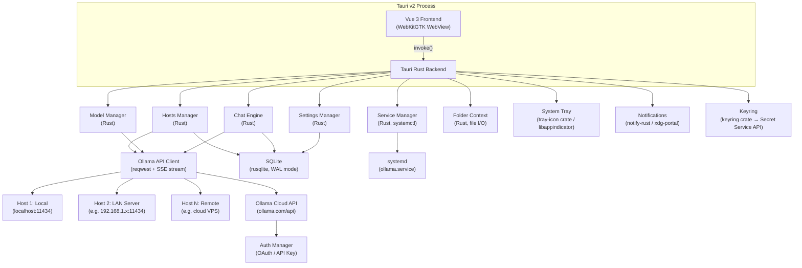

# Ollama Desktop — Linux Native Client

> **Product Specification v1.0** — 2026-03-25
> Target: Arch Linux · KDE Plasma 6 · Native Wayland

---

## 1. Vision & Purpose

### 1.1 Problem Statement

Ollama's official desktop application is available for macOS and Windows but lacks a native Linux client. Linux power users — particularly those on KDE Plasma 6 / Wayland — are limited to the CLI, third-party web UIs, or Electron wrappers that feel alien to the desktop environment.

### 1.2 Product Vision

A **first-class, lightweight Linux desktop client** for Ollama that:

- Delivers full feature parity with the Windows/macOS desktop app
- Mirrors the clean, sleek, modern look of the official Ollama Windows app
- Runs as a Tauri v2 native app with a Rust backend — no Electron bloat
- Integrates with the Linux desktop (system tray, Wayland, xdg-portal)
- Provides a premium, modern chat experience with smooth streaming and polished UI

### 1.3 Target Users

| Persona | Description |
|---|---|
| **Power Dev** | Software developer running local LLMs for coding assistance, code review, and document analysis |
| **AI Researcher** | ML/AI practitioner experimenting with open-weight models, comparing outputs, tuning parameters |
| **Privacy-First User** | User who wants ChatGPT-class UX without sending data to third-party clouds |
| **Tinkerer** | Arch Linux / KDE enthusiast who values native look-and-feel and system integration |

### 1.4 Success Criteria

- Full functional parity with the Ollama Windows desktop app
- UI visually matches the clean, modern aesthetic of the official Ollama Windows client
- Tauri v2 native window with Wayland support
- Linux system tray integration (KDE, GNOME, Hyprland)
- Sub-100ms input-to-first-token-rendered latency (local models)
- AUR package available for Arch Linux

---

## 2. Feature Specification

### 2.1 Core Chat Interface

| ID | Feature | Priority | Notes |
|---|---|---|---|
| C-01 | **Multi-turn chat** | P0 | Persistent conversation threads with full history |
| C-02 | **Streaming text rendering** | P0 | Token-by-token display with typing cursor animation |
| C-03 | **Reasoning/thinking blocks** | P0 | Collapsible `<think>` panels with console-style monospace rendering and pulsing border; rest of UI uses standard proportional font |
| C-04 | **Markdown rendering** | P0 | Full GFM: tables, code fences, math (KaTeX), mermaid diagrams |
| C-05 | **Code blocks with copy button** | P0 | Language detection, syntax highlighting, one-click copy |
| C-06 | **Chat history persistence** | P0 | SQLite-backed; search, rename, pin, delete conversations |
| C-07 | **Multi-chat tabs/panels** | P1 | Side-by-side or tabbed conversations |
| C-08 | **Chat export** | P1 | Export to Markdown, JSON, PDF |
| C-09 | **Chat branching** | P2 | Fork conversation at any message to explore alternatives |
| C-10 | **Chat backup & restore** | P1 | Full JSON export/import of all chat history; also supports raw SQLite database file backup/restore for migration |
| C-11 | **Compact / TWM mode** | P1 | Toggle for tiling WM users (Hyprland, Sway, i3): hides sidebar, reduces padding/margins, optimizes for narrow vertical splits |

### 2.2 Multimodal Input

| ID | Feature | Priority | Notes |
|---|---|---|---|
| M-01 | **Image input** | P0 | Paste, drag-drop, or file-pick images for vision models (e.g., LLaVA, Gemma 3) |
| M-02 | **File drag-and-drop** | P0 | Drop PDFs, text, code files into chat for summarization/analysis |
| M-03 | **Document preview** | P1 | Thumbnail/preview of attached files before sending |
| M-04 | **Clipboard image paste** | P0 | Ctrl+V image directly from clipboard |
| M-05 | **Audio input** | P2 | Whisper-based speech-to-text via local model |

### 2.3 Model Management

| ID | Feature | Priority | Notes |
|---|---|---|---|
| MO-01 | **Browse local models** | P0 | List installed models with size, family, quantization, parameter count |
| MO-02 | **Search Ollama library** | P0 | Search `ollama.com/library` for available models |
| MO-03 | **Download/pull models** | P0 | Progress bar, pause/resume, bandwidth throttling |
| MO-04 | **Delete models** | P0 | Bulk or individual deletion with size reclaim indicator |
| MO-05 | **Model details view** | P0 | Modelfile contents, license, capabilities, context length |
| MO-06 | **Custom model creation** | P1 | Create models from Modelfile (system prompt, parameters, adapters) |
| MO-07 | **Model tags/favorites** | P1 | Organize models with user tags and quick-access favorites |
| MO-08 | **Configurable storage path** | P0 | Choose where model blobs are stored (mirroring Windows feature) |
| MO-09 | **Model update notifications** | P1 | Detect when newer versions of pulled models are available |

### 2.4 Ollama Cloud Integration

| ID | Feature | Priority | Notes |
|---|---|---|---|
| CL-01 | **User authentication** | P0 | Sign in to `ollama.com` account via OAuth or API key |
| CL-02 | **Cloud model access** | P0 | Run models hosted on Ollama Cloud; seamless fallback between local ↔ cloud |
| CL-03 | **API key management** | P0 | Generate, view (masked), revoke API keys from within the app |
| CL-04 | **Private model sync** | P1 | Push/pull private models to/from Ollama Cloud |
| CL-05 | **Usage dashboard** | P1 | Cloud compute usage, token counts, cost tracking |
| CL-06 | **Web search integration** | P0 | Leverage Ollama's Web Search API for grounded responses |

### 2.5 Context & Generation Settings

| ID | Feature | Priority | Notes |
|---|---|---|---|
| S-01 | **Temperature slider** | P0 | Range 0.0–2.0 with live preview of randomness level |
| S-02 | **Context length slider** | P0 | Adjustable num_ctx with memory impact indicator |
| S-03 | **System prompt editor** | P0 | Per-conversation system prompt with templates library |
| S-04 | **Top-P / Top-K** | P0 | Fine-grained sampling control |
| S-05 | **Repeat penalty** | P0 | Control repetition (repeat_penalty, repeat_last_n) |
| S-06 | **Stop sequences** | P1 | Custom stop tokens |
| S-07 | **Seed control** | P1 | Fixed seed for reproducible outputs |
| S-08 | **Mirostat** | P1 | Mirostat 1/2 with tau and eta parameters |
| S-09 | **Preset profiles** | P1 | Save/load parameter presets ("Creative", "Precise", "Code") |
| S-10 | **Per-model defaults** | P1 | Different default settings per model |

### 2.6 GPU & Performance

| ID | Feature | Priority | Notes |
|---|---|---|---|
| G-01 | **GPU status display** | P0 | Show VRAM usage, GPU utilization, model loaded status |
| G-02 | **Multi-GPU support** | P0 | Leverage Ollama's multi-GPU scheduling |
| G-03 | **CPU fallback indicator** | P0 | Visual indicator when running on CPU vs GPU |
| G-04 | **Performance metrics** | P1 | Tokens/sec, time-to-first-token, total generation time |
| G-05 | **GPU layer configuration** | P1 | Control num_gpu layers for partial offloading |

### 2.7 Networking, Hosts & Sharing

| ID | Feature | Priority | Notes |
|---|---|---|---|
| N-01 | **LAN mode** | P0 | Share models across local network (mirrors Windows feature) |
| N-02 | **Hosts Manager** | P0 | Settings panel to add/edit/remove multiple Ollama endpoints (Localhost, Home Server, Cloud VPS, etc.) with name, URL, and optional auth; active host selectable from a dropdown in the top bar |
| N-03 | **Quick host switching** | P0 | Dropdown in the chat header to switch active Ollama host without leaving the conversation; model list refreshes on switch |
| N-04 | **Host health indicator** | P1 | Colored dot (🟢 online / 🔴 offline) next to each host; periodic background ping to `/api/tags` |
| N-05 | **Proxy support** | P1 | HTTP/SOCKS5 proxy for corporate environments |

### 2.8 Coding Tools Integration

| ID | Feature | Priority | Notes |
|---|---|---|---|
| CT-01 | **`ollama launch` support** | P1 | Quick-launch coding tools (Claude Code, OpenCode, Codex) |
| CT-02 | **Anthropic Messages API compat** | P1 | Use local models with Claude Code–compatible tools |
| CT-03 | **Tool calling visualization** | P1 | Show function/tool calls and results inline in chat |

### 2.9 Image Generation (Experimental)

| ID | Feature | Priority | Notes |
|---|---|---|---|
| IG-01 | **Local image generation** | P2 | When Ollama ships Linux image gen support, integrate natively |
| IG-02 | **Image gallery** | P2 | Browse, save, and re-generate images |

### 2.10 Local Folder Context (Lightweight RAG)

| ID | Feature | Priority | Notes |
|---|---|---|---|
| LFC-01 | **Link local directories** | P1 | User can attach one or more local folders to a conversation via the settings panel or a "📂 Add Context" button |
| LFC-02 | **File parsing** | P1 | Parse `.txt`, `.md`, `.py`, `.rs`, `.js`, `.ts`, `.json`, `.yaml`, `.toml`, `.csv`, `.html` — inject content as context to the LLM |
| LFC-03 | **Selective file inclusion** | P1 | Tree-view file picker to include/exclude individual files within linked folders |
| LFC-04 | **Context size indicator** | P1 | Show estimated token count of injected context vs. model's `num_ctx` limit |
| LFC-05 | **Auto-refresh** | P2 | Optionally watch linked folders for changes and refresh context when files are modified |

> **Design note:** This is intentionally lightweight — no vector database, no embedding model. Files are read, parsed to text, and prepended to the conversation context. For large codebases, users select relevant subdirectories rather than indexing everything.

---

## 3. User Interface Design

### 3.1 Design Philosophy

> **"Indistinguishable from the official app — just on Linux."**

The UI must replicate the **clean, minimal, modern aesthetic** of the official Ollama Windows desktop app. It is a polished chat GUI, not a terminal. The overall experience should feel like a premium consumer product:

- **Clean white/dark surfaces** with ample whitespace
- **Proportional sans-serif typography** for all chat messages and UI elements
- **Rounded message bubbles**, soft shadows, smooth transitions
- **No terminal aesthetic** in the main interface

The **only exception** is the `<think>` / reasoning collapsible block: inside these panels, a **monospace console-style font**, a **pulsing border animation**, and a **subtle dark background** create a deliberate visual contrast that signals "the model is thinking." This is the sole place where console aesthetics appear.

The app uses **Tauri v2** for the native shell (Rust backend) and **Vue 3 + TailwindCSS** for the web frontend — delivering near-native performance without Electron's overhead.

### 3.2 Layout Architecture

```
┌─────────────────────────────────────────────────────────┐
│  ☰  Ollama Desktop              ─ □ ✕  │ Title Bar     │
├────────────┬────────────────────────────────────────────┤
│            │  Model: llama3:70b ▼  │ ⚙ Settings │  🌐 │
│  Chat      ├────────────────────────────────────────────┤
│  History   │                                            │
│            │  ┌──────────────────────────────────────┐  │
│  ● Today   │  │  User message                        │  │
│    Chat 1  │  └──────────────────────────────────────┘  │
│    Chat 2  │                                            │
│            │  ┌──────────────────────────────────────┐  │
│  ● Yester  │  │  ⟩ Thinking...                       │  │
│    Chat 3  │  │                                      │  │
│            │  │  ▊ Streaming response with            │  │
│  ─────────│  │    beautiful typing effects...        │  │
│  ☁ Cloud   │  │                                      │  │
│  📦 Models │  │  ```python                           │  │
│  ⚙ Config  │  │  def hello():                        │  │
│            │  │      print("world")                   │  │
│            │  │  ```  [📋 Copy]                       │  │
│            │  └──────────────────────────────────────┘  │
│            ├────────────────────────────────────────────┤
│            │  📎 │ Type a message...          │ ⬆ Send │
│            │     │                            │        │
└────────────┴────────────────────────────────────────────┘
```

### 3.3 Streaming & Visual Effects

The chat experience uses two distinct visual modes:

#### Standard Chat (applies to all assistant messages)

| Effect | Description |
|---|---|
| **Smooth word-group rendering** | Text appears in small word-groups (2-4 words) for a fluid reading experience — not raw character-by-character |
| **Markdown progressive render** | Headings, lists, tables, and inline formatting render as tokens arrive |
| **Code block streaming** | Fenced code blocks appear with live syntax highlighting (Shiki) as tokens arrive |
| **Smooth scroll-lock** | Auto-scroll follows generation; user scroll-up pauses auto-scroll; "↓ Jump to bottom" pill appears |
| **Fade-in paragraphs** | Completed paragraphs do a subtle opacity fade-in (0.9→1.0, 120ms ease-out) |
| **Speed indicator** | Small "42 tok/s" badge pinned to bottom-right of the active message during generation |

#### Console-Style Reasoning Block (applies ONLY to `<think>` tags)

| Effect | Description |
|---|---|
| **Collapsible panel** | `<think>` content is wrapped in a collapsible card, default-collapsed once generation completes |
| **Monospace font** | Content inside uses `JetBrains Mono` / `Fira Code` with reduced font size (0.85em) |
| **Pulsing border** | Left border pulses with accent color (`#FF6B35`) while actively generating |
| **Dark background** | Subtle dark/muted background (`bg-neutral-900/50` dark, `bg-neutral-100` light) to visually separate from normal chat |
| **Token-by-token cursor** | Single blinking block cursor (`▊`) renders character-by-character inside the thinking block |
| **"Thinking..." label** | Header shows animated ellipsis label while generating; changes to "Thought for Xs" on completion |

### 3.4 Visual Design Tokens

| Token | Value | Notes |
|---|---|---|
| **Color Scheme** | Light/dark auto via `prefers-color-scheme` | Also respects manual toggle in settings |
| **Accent Color** | `#FF6B35` (Ollama Orange) | Send button, active tabs, links, thinking-block border |
| **Surface — Light** | `#FFFFFF` (cards), `#F9FAFB` (background) | Clean, bright surfaces matching official app |
| **Surface — Dark** | `#1A1A1A` (cards), `#0F0F0F` (background) | True dark mode, not gray |
| **Font — UI & Chat** | `Inter` (400/500/600) via Google Fonts | Clean, modern sans-serif; 15px base for chat, 14px for UI |
| **Font — Code / Thinking** | `JetBrains Mono` / `Fira Code` | Ligatures enabled; used ONLY in code fences and `<think>` blocks |
| **Border Radius** | 12px (message bubbles), 16px (cards), 8px (buttons), 24px (input) | Generously rounded, matching modern chat apps |
| **Spacing Scale** | 4px base unit | 4, 8, 12, 16, 24, 32, 48 |
| **Shadows** | `shadow-sm` for cards, `shadow-lg` for modals | Soft, subtle elevation |
| **Animations** | 150ms ease-out for UI transitions | Respects `prefers-reduced-motion`; thinking border pulse uses CSS keyframes |

### 3.5 Keyboard Shortcuts

| Shortcut | Action |
|---|---|
| `Enter` | Send message |
| `Shift+Enter` | New line in input |
| `Ctrl+N` | New conversation |
| `Ctrl+W` | Close current chat tab |
| `Ctrl+K` | Quick model switcher (command palette) |
| `Ctrl+,` | Open settings |
| `Ctrl+Shift+C` | Copy last response |
| `Ctrl+/` | Toggle sidebar |
| `Escape` | Stop generation |
| `Ctrl+↑/↓` | Navigate chat history |
| `F11` | Toggle fullscreen |
| `Ctrl+Shift+M` | Toggle Compact / TWM Mode |
| `Ctrl+H` | Open Hosts Manager / switch active host |

### 3.6 Compact / TWM Mode

A dedicated layout mode for **tiling window manager** users (Hyprland, Sway, i3, bspwm) who run the app in narrow vertical splits.

| Behavior | Standard Mode | Compact / TWM Mode |
|---|---|---|
| **Sidebar** | Visible (260px) | Hidden; accessible via `Ctrl+/` overlay |
| **Message padding** | 16px horizontal, 12px vertical | 8px horizontal, 6px vertical |
| **Input area** | Multi-line with attachment bar | Single-line; attachment via `Ctrl+Shift+A` |
| **Top bar** | Model selector + settings + cloud | Model name only (truncated) + host indicator dot |
| **Code blocks** | Full-width with header | Compact; horizontal scroll at 100% container width |
| **Font sizes** | 15px chat, 14px UI | 13px chat, 12px UI |
| **Minimum useful width** | ~500px | ~320px |

Compact mode is toggled from Settings → Appearance or via `Ctrl+Shift+M`. The state persists across sessions.

### 3.7 Connection Error / Ollama Not Found Screen

Displayed when the app cannot reach the active Ollama host on startup or after connection loss.

```
┌─────────────────────────────────────────────┐
│                                             │
│             🦙                              │
│                                             │
│    Couldn't connect to Ollama               │
│                                             │
│    The Ollama server at localhost:11434      │
│    is not responding.                        │
│                                             │
│    ┌───────────────────────────────────┐     │
│    │ Install Ollama:                   │     │
│    │ curl -fsSL https://ollama.com/    │     │
│    │ install.sh | sh         [📋 Copy] │     │
│    └───────────────────────────────────┘     │
│                                             │
│    [ 🔄 Retry Connection ]                  │
│    [ ▶ Start Ollama Service ]               │
│    [ ⚙ Change Host / Settings ]             │
│                                             │
│    ─────────────────────────────────         │
│    Already installed? The service may        │
│    not be running. Click "Start Ollama       │
│    Service" to run:                          │
│    systemctl start ollama                    │
│                                             │
└─────────────────────────────────────────────┘
```

| Element | Behavior |
|---|---|
| **Retry Connection** | Re-pings the active host's `/api/tags` endpoint |
| **Start Ollama Service** | Executes `systemctl start ollama` via the Rust backend (with polkit prompt if needed); button disabled if service is already active |
| **Change Host / Settings** | Opens the Hosts Manager to select a different endpoint |
| **Install command** | One-click copy of the official Ollama install script URL |
| **Auto-retry** | Background ping every 5 seconds; screen auto-dismisses when connection succeeds |

---

## 4. Architecture

### 4.1 Technology Stack

| Layer | Technology | Rationale |
|---|---|---|
| **Native Shell** | Tauri v2 | Lightweight native window (WebView2/WebKitGTK); ~5MB binary vs Electron's 200MB+; Rust backend for performance-critical logic |
| **Backend Language** | Rust (via Tauri commands) | Type-safe, memory-safe; handles Ollama API streaming, SQLite persistence, file I/O, system tray, keyring access |
| **Frontend Framework** | Vue 3 (Composition API) + TypeScript | Reactive, component-driven UI; excellent ecosystem; fast hot-reload DX |
| **Styling** | TailwindCSS v4 | Utility-first CSS; rapid iteration; built-in dark mode; design token consistency |
| **Markdown Rendering** | `markdown-it` + `shiki` (syntax HL) + `katex` (math) | Streaming-compatible; pluggable; code highlighting without runtime overhead |
| **State Management** | Pinia | Vue 3's official store; simple, TypeScript-native |
| **Storage** | SQLite via `rusqlite` (Rust-side) | Chat history, settings, model metadata; WAL mode for crash safety |
| **Build System** | `cargo-tauri` (Rust) + Vite (frontend) | Standard Tauri v2 toolchain; fast dev builds via Vite |
| **Packaging** | PKGBUILD (AUR), `.deb`, AppImage | Tauri's built-in bundler for Linux targets |

### 4.2 System Architecture



### 4.2.1 Frontend ↔ Backend Communication

Tauri v2 uses **IPC commands** for frontend-to-backend calls and **events** for backend-to-frontend streaming:

| Pattern | Mechanism | Example |
|---|---|---|
| **Request/Response** | `invoke('command_name', payload)` | Fetch model list, save settings, delete conversation |
| **Streaming** | Tauri event channels (`emit` / `listen`) | Token-by-token chat streaming, model download progress |
| **File access** | Tauri FS plugin (scoped) | Read dropped files, export chat history |

### 4.3 API Integration

The client communicates with Ollama via its REST API:

| Endpoint | Method | Purpose |
|---|---|---|
| `/api/generate` | POST (streaming) | Text generation with streaming SSE |
| `/api/chat` | POST (streaming) | Multi-turn chat with streaming |
| `/api/tags` | GET | List local models |
| `/api/show` | POST | Model details |
| `/api/pull` | POST (streaming) | Download model with progress |
| `/api/delete` | DELETE | Remove model |
| `/api/create` | POST | Create custom model from Modelfile |
| `/api/ps` | GET | Running models and GPU usage |
| `ollama.com/api/*` | Various | Cloud model access (authenticated) |

> **Multi-host routing:** All API calls are routed through the **Hosts Manager**, which resolves the currently active host URL. The `Ollama API Client` prefixes all endpoint paths with the active host's base URL. Switching hosts at runtime re-fetches the model list and updates the UI immediately.

### 4.4 Data Model

```
conversations
├── id (UUID)
├── title (text)
├── model (text)
├── system_prompt (text)
├── settings_json (JSON blob)
├── created_at, updated_at
├── pinned (bool)
└── tags (text[])

messages
├── id (UUID)
├── conversation_id (FK)
├── role (user|assistant|system)
├── content (text)
├── images (blob[])
├── files (JSON metadata)
├── tokens_used (int)
├── generation_time_ms (int)
└── created_at

settings
├── key (text PK)
└── value (JSON)

model_cache
├── name (text PK)
├── host_id (FK → hosts.id)   -- which host this model belongs to
├── size_bytes (int)
├── family (text)
├── parameters (text)
├── quantization (text)
├── capabilities (JSON)
└── last_synced_at

hosts
├── id (UUID PK)
├── name (text)               -- user-friendly label (e.g. "Home Server")
├── url (text)                -- base URL (e.g. "http://192.168.1.50:11434")
├── auth_token (text, nullable) -- optional bearer token (stored encrypted in keyring)
├── is_default (bool)         -- the host selected on app startup
├── is_active (bool)          -- currently selected host this session
├── last_ping_status (text)   -- "online" | "offline" | "unknown"
├── last_ping_at (datetime)
└── created_at

folder_contexts
├── id (UUID PK)
├── conversation_id (FK → conversations.id)
├── path (text)               -- absolute filesystem path
├── included_files (JSON)     -- list of relative paths included (null = all)
├── auto_refresh (bool)       -- watch for changes
├── estimated_tokens (int)    -- last calculated token estimate
└── created_at
```

---

## 5. Non-Functional Requirements

### 5.1 Performance

| Metric | Target |
|---|---|
| Cold start to interactive | < 2 seconds (Tauri + WebKitGTK cold start) |
| Input-to-first-token latency (local) | < 100ms (app overhead only) |
| Streaming render FPS | 60 FPS sustained during token rendering |
| Memory footprint (idle) | < 120 MB RSS (Tauri + WebKitGTK baseline) |
| Memory footprint (active chat) | < 250 MB RSS (excluding model VRAM) |
| App binary size | < 15 MB (Tauri bundle, excluding WebKitGTK system dep) |
| Chat history search | < 200ms for 10,000 messages |

### 5.2 Reliability

- Graceful handling of Ollama server disconnection/reconnection
- No data loss on unexpected app termination (WAL-mode SQLite)
- Automatic retry with exponential backoff for cloud operations
- Crash reporter with optional telemetry (opt-in)

### 5.3 Security

- API keys stored via `keyring` Rust crate → Secret Service API (works with KWallet, GNOME Keyring, KeePassXC) — never plaintext on disk
- OAuth tokens stored via the same system keyring
- Tauri's scoped filesystem — frontend can only access explicitly allowed paths
- No telemetry by default; all telemetry opt-in
- TLS 1.3 for all cloud communications (via `rustls`)
- CSP headers enforced in WebView to prevent XSS

### 5.4 Accessibility

- Full keyboard navigation (tab order, focus rings, skip links)
- ARIA attributes on all interactive elements (standard web accessibility)
- Respect system font size and scaling (via `rem` units + system DPI)
- High contrast mode support (TailwindCSS `forced-colors` media query)
- `prefers-reduced-motion` respected — disables thinking-block pulse and fade-in animations

### 5.5 Internationalization

- UI strings externalized via `vue-i18n` with JSON locale files
- Initial release: English only
- TailwindCSS `rtl:` variant for RTL layout support
- Architecture supports CJK rendering via system fonts

---

## 6. Linux Desktop Integration

| Integration | Implementation |
|---|---|
| **System tray** | `tray-icon` Rust crate + `libappindicator` — works on KDE (SNI), GNOME, Hyprland |
| **Notifications** | `notify-rust` crate → D-Bus `org.freedesktop.Notifications` (universal across DEs) |
| **Global shortcuts** | Tauri v2 global shortcut plugin — configurable hotkey to summon the app |
| **Dark/light mode** | `prefers-color-scheme` media query — auto-follows system theme |
| **File dialogs** | Tauri v2 dialog plugin → `xdg-desktop-portal` (native KDE/GNOME file picker) |
| **Secrets storage** | `keyring` crate → D-Bus Secret Service API (KWallet, GNOME Keyring, KeePassXC) |
| **Desktop file** | `.desktop` file with proper categories, MIME types, icons |
| **Wayland support** | WebKitGTK native Wayland rendering; Tauri window decorations via `xdg-decoration` |
| **Fractional scaling** | Handled by WebKitGTK + compositor; CSS `rem` units scale naturally |
| **Autostart** | Optional `.desktop` file in `~/.config/autostart/` — user-togglable in Settings → General; disabled by default; autostart entry launches the app minimized to system tray |
| **Ollama systemd service** | "Start Ollama Service" button in Connection Error screen and Settings → Advanced executes `systemctl --user start ollama` (or `systemctl start ollama` with polkit elevation); the app does **not** auto-start the service — explicit user action only |
| **Connection Error fallback** | When the active Ollama host is unreachable: display Connection Error screen (§3.7) with Retry, Start Service, and Change Host actions; background auto-retry every 5 seconds |

---

## 7. Packaging & Distribution

| Channel | Format | Notes |
|---|---|---|
| **AUR** | PKGBUILD | Primary distribution for Arch Linux |
| **`.deb`** | Tauri bundler output | Ubuntu/Debian via PPA or direct download |
| **AppImage** | Portable binary | Universal, no-install option |
| **Flatpak** | org.ollama.Desktop | Sandboxed universal package (future) |
| **Source** | `cargo build` + `pnpm build` | For manual compilation |

### 7.1 Dependencies

```
Build-time:
  rust >= 1.77 (with cargo)
  node >= 20 LTS (with pnpm)
  tauri-cli >= 2.0

Runtime (system packages):
  webkit2gtk-4.1          (Tauri v2 WebView backend)
  gtk3                    (GTK runtime for Tauri window)
  libappindicator-gtk3    (system tray support)
  libsoup3                (HTTP backend for WebKitGTK)
  glib2                   (GLib runtime)
  sqlite3                 (bundled via rusqlite, but system lib preferred)
  xdg-desktop-portal      (native file dialogs, screenshots)
  libsecret               (Secret Service API for keyring)

Optional:
  xdg-desktop-portal-kde  (KDE-native file dialogs on Plasma)
  xdg-desktop-portal-gtk  (GNOME-native file dialogs)
```

---

## 8. Decision Log

| # | Decision | Alternatives Considered | Rationale |
|---|---|---|---|
| D-01 | **Tauri v2** over Electron | Electron, Qt6/QML, GTK4, Flutter | ~15MB vs 200MB+ bundle; Rust backend for performance; native WebKitGTK on Linux; web frontend enables rapid UI iteration |
| D-02 | **Rust** backend language | C++, Go, Node.js | Memory-safe, zero-cost abstractions; Tauri's native language; excellent async streaming via `tokio` + `reqwest` |
| D-03 | **Vue 3 + TailwindCSS** frontend | React, Svelte, SolidJS | Vue 3 Composition API is lightweight and ergonomic; TailwindCSS v4 enables rapid, consistent styling; excellent TypeScript support |
| D-04 | **SQLite** for persistence | PostgreSQL, flat files, IndexedDB | Zero-config, single-file, WAL mode for crash safety; `rusqlite` is mature and Rust-native |
| D-05 | **Secret Service API** for secrets | KWallet-only, env vars, encrypted files | D-Bus Secret Service is DE-agnostic — works with KWallet, GNOME Keyring, and KeePassXC |
| D-06 | **AUR-first** distribution | DEB/RPM repos, Snap, Flatpak | Target audience is Arch Linux; AUR is the canonical package source; `.deb` and AppImage for broader reach |
| D-07 | **Clean modern UI** (not terminal) | Terminal-style, hybrid | Matching the official Ollama Windows app aesthetic ensures user familiarity; console effects reserved only for `<think>` reasoning blocks for clear visual separation |
| D-08 | **Optional autostart, no auto-service** | Auto-start ollama on app launch | App should autostart to tray (opt-in) but never auto-start the Ollama service without explicit user click — respects user control and avoids unexpected resource usage |
| D-09 | **Guide + Retry for missing Ollama** | Auto-install Ollama, hard block | Never auto-install system software; show friendly Connection Error screen with install instructions, copy button, and "Start Service" action |
| D-10 | **Multi-host Manager (not simultaneous)** | Single localhost only, multi-simultaneous | Multiple named hosts with one active at a time — covers home server, cloud VPS, and corporate setups without the UX complexity of simultaneous connections |
| D-11 | **Lightweight file context (no RAG)** | Full vector DB + embeddings, no context | Plain text injection is sufficient for most use cases; no dependencies on embedding models or vector stores; keeps the app lightweight and Ollama-focused |
| D-12 | **Full chat backup/restore** | No backup, partial export only | JSON export/import + raw SQLite backup covers both casual users and power users; essential for migration between machines |
| D-13 | **Compact / TWM mode** | Responsive-only, no dedicated mode | Tiling WM users (Hyprland/Sway/i3) need more than responsive breakpoints — dedicated compact mode with reduced padding, hidden sidebar, and narrow-width optimization |

---

## 9. Assumptions

1. The app connects to **one active Ollama host at a time** (selected from the Hosts Manager); the default is `localhost:11434`
2. Ollama is installed and managed by the user separately; the app provides guidance and a "Start Service" button but never auto-installs Ollama
3. Ollama's REST API remains stable (currently v1)
4. Ollama Cloud authentication uses `ollama signin` flow or API keys
5. The user has a GPU supported by Ollama (NVIDIA CUDA or AMD ROCm); CPU fallback works
6. WebKitGTK is available on the target Linux system (standard on most distributions)
7. KDE Plasma 6 with Wayland session is the primary target; GNOME, Hyprland, Sway, and X11 are supported
8. Ollama's future Linux image generation feature will use the same API patterns as macOS

---

## 10. Risks & Mitigations

| Risk | Impact | Likelihood | Mitigation |
|---|---|---|---|
| Ollama API breaking changes | Feature breakage | Low | Pin to API version; adapter layer abstracts API |
| WebKitGTK version fragmentation | Rendering inconsistencies | Medium | Target WebKitGTK 4.1+; CI test matrix across Ubuntu LTS, Arch, Fedora |
| Long chat DOM performance | UI stutter with 1000+ messages | Medium | Virtual scrolling (`vue-virtual-scroller`); message recycling; lazy Markdown rendering |
| Ollama Cloud API changes | Auth/cloud features break | Medium | Loose coupling; feature flags for cloud features |
| Wayland compositor quirks | Window decoration issues | Low | Tauri handles via `xdg-decoration`; test on KWin, Sway, Hyprland |
| Large model downloads fail | User frustration | Medium | Resume support; integrity verification; progress persistence |
| Tauri v2 Linux maturity | Edge-case bugs | Low | Active Tauri community; WebKitGTK is well-tested on Linux; report upstream |

---

## 11. Milestones

| Phase | Scope | Duration |
|---|---|---|
| **Phase 1 — MVP** | Chat interface, streaming, local model management, basic settings, Connection Error screen, Compact/TWM Mode, system tray with optional autostart | 8 weeks |
| **Phase 2 — Cloud** | Authentication, cloud models, web search, API key management | 4 weeks |
| **Phase 3 — Polish** | Hosts Manager (multi-host), multimodal input, file drag-drop, chat backup/restore, Linux desktop integrations, keyboard shortcuts | 4 weeks |
| **Phase 4 — Advanced** | Local Folder Context (lightweight RAG), chat branching, coding tools, image generation, performance metrics | 4 weeks |
| **Phase 5 — Distribution** | AUR package, `.deb`, AppImage, documentation, contributor guide | 2 weeks |

---

## 12. Non-Goals (Explicit Exclusions)

- ❌ Mobile app (this is a desktop-only specification)
- ❌ Built-in model training or fine-tuning
- ❌ Multi-user / team collaboration features
- ❌ Plugin/extension system (defer to v2)
- ❌ Windows or macOS support (Ollama already provides these)
- ❌ Bundling the Ollama server itself (user installs separately)
- ❌ Auto-installing Ollama if not found (provide guidance only, never execute install scripts automatically)
- ❌ Running as a standalone web app in a browser (this is a native desktop app via Tauri)
- ❌ Terminal-style UI for the main chat interface (console aesthetic is restricted to `<think>` reasoning blocks only)
- ❌ Full vector database / embedding-powered RAG (Local Folder Context uses plain text injection only)
- ❌ Connecting to multiple Ollama hosts simultaneously (one active host at a time)

*Document generated via brainstorming and product manager skills analysis.*
*Feature parity baseline: Ollama Windows Desktop App (March 2026).*
*Stack: Tauri v2 (Rust) + Vue 3 + TailwindCSS · UI: Clean modern chat matching official Ollama app.*

