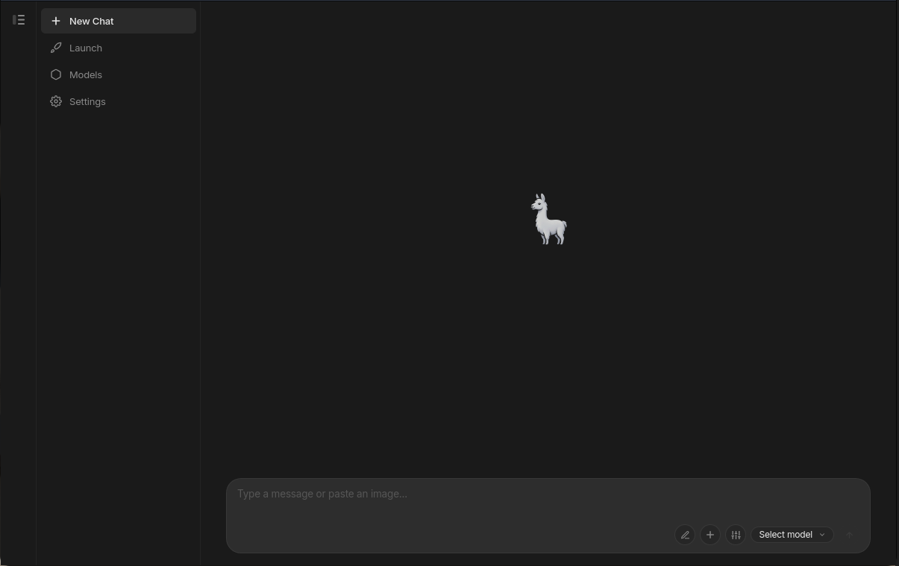

<p align="center">
  
</p>

<h1 align="center">Alpaka Desktop</h1>

<p align="center">
  A native desktop client for <a href="https://ollama.com">Ollama</a> — built with Tauri v2 and Vue 3.
</p>

<p align="center">
  <a href="LICENSE"></a>
  <a href="https://github.com/nikoteressi/alpaka-desktop/releases/latest"></a>
  <a href="https://github.com/nikoteressi/alpaka-desktop/actions/workflows/release.yml"></a>
</p>

<br/>

<p align="center">
  
</p>

<br/>

---

## Features

- **Local-first AI** — connects directly to your local Ollama instance; your conversations never leave your machine.
- **Real-time token streaming** — smooth, latency-optimized SSE streaming with live markdown rendering.
- **Thinking / reasoning blocks** — collapsible `<think>` panels for models that expose their chain of thought.
- **Multi-host management** — add multiple Ollama endpoints, ping health status, and switch between them instantly.
- **Hardware-aware model browser** — see model size, quantization, parameter count, and GPU/VRAM requirements at a glance.
- **Folder context** — attach a local directory as context and include specific files in your prompt.
- **Secure keyring integration** — API keys and OAuth tokens stored in the system Secret Service, never in SQLite.
- **Native Linux UX** — system tray, desktop notifications, KDE Plasma / Wayland first-class support.
- **Syntax highlighting + math** — code blocks powered by Shiki; LaTeX rendered via KaTeX.

---

## Installation

### AppImage (any distro)

Download the latest `.AppImage` from the [Releases](https://github.com/nikoteressi/alpaka-desktop/releases/latest) page:

```bash
chmod +x alpaka-desktop_*.AppImage
./alpaka-desktop_*.AppImage
```

To integrate with your desktop launcher, run with `--appimage-integrate`.

### Debian / Ubuntu — APT repository

Add the repository once, then use `apt` like any other package:

```bash
# Import signing key
curl -fsSL https://nikoteressi.github.io/alpaka-desktop/apt/key.gpg | sudo gpg --dearmor -o /etc/apt/keyrings/alpaka-desktop.gpg

# Add repository (single line — copy the whole command)
echo "deb [arch=amd64 signed-by=/etc/apt/keyrings/alpaka-desktop.gpg] https://nikoteressi.github.io/alpaka-desktop/apt stable main" | sudo tee /etc/apt/sources.list.d/alpaka-desktop.list

# Install
sudo apt update && sudo apt install alpaka-desktop
```

Future updates arrive automatically with `sudo apt upgrade`.

**One-off .deb install** (no repository needed):
```bash
sudo dpkg -i alpaka-desktop_*_amd64.deb
```

### Arch Linux — AUR

```bash
yay -S alpaka-desktop-bin      # installs the pre-built AppImage
# or
yay -S alpaka-desktop-git      # builds from source
```

### Arch Linux — local pacman build

Build a native `.pkg.tar.zst` directly from the repo (no AUR helper required):

```bash
git clone https://github.com/nikoteressi/alpaka-desktop.git
cd alpaka-desktop
./packaging/build-pacman.sh
sudo pacman -U packaging/out/alpaka-desktop-*.pkg.tar.zst
```

---

## Build from Source

### Prerequisites

**Rust (stable ≥ 1.77.2):**
```bash
curl --proto '=https' --tlsv1.2 -sSf https://sh.rustup.rs | sh
```

**Node.js + pnpm:**
```bash
# Node.js 20 LTS via nvm, or your distro's package manager
npm install -g pnpm
```

**Linux system dependencies (Ubuntu/Debian):**
```bash
sudo apt update && sudo apt install -y \
  libwebkit2gtk-4.1-dev \
  libappindicator3-dev \
  librsvg2-dev \
  patchelf \
  libssl-dev \
  libgtk-3-dev \
  libayatana-appindicator3-dev
```

**Arch Linux:**
```bash
sudo pacman -S webkit2gtk-4.1 libappindicator-gtk3 librsvg
```

### Build

```bash
git clone https://github.com/nikoteressi/alpaka-desktop.git
cd alpaka-desktop
pnpm install
pnpm tauri build
```

The resulting AppImage and `.deb` will be in `src-tauri/target/release/bundle/`.

### Development (hot reload)

```bash
pnpm tauri dev
```

---

## Requirements

- Linux (x86_64)
- [Ollama](https://ollama.com/download/linux) running locally or on a reachable host
- A Secret Service provider for keyring (KWallet, GNOME Keyring, or `keepassxc` with DBus bridge)

---

## Contributing

Contributions are welcome! See [CONTRIBUTING.md](CONTRIBUTING.md) for setup instructions, testing guidelines, and the PR workflow.

---

## License

[MIT](LICENSE) © 2026 Alpaka Desktop Contributors
