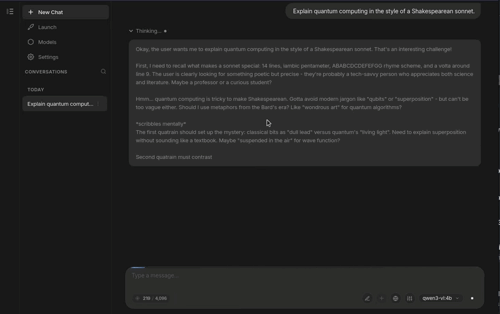
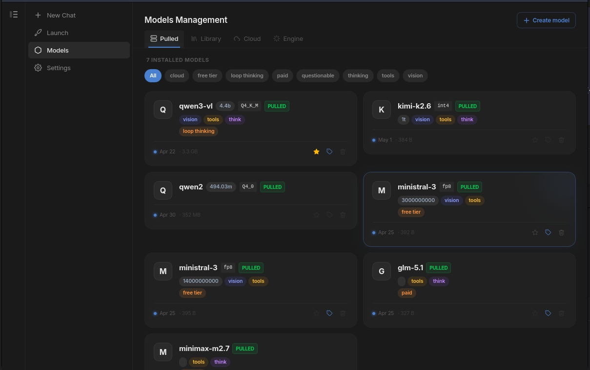
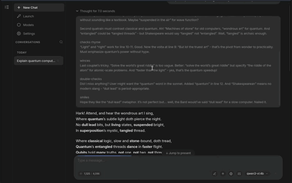

## See It In Action

<div class="demo-grid">


*Real-time token streaming with live Markdown*


*Browse, pull, and manage local models*


*Collapsible chain-of-thought reasoning panels*

</div>

::: tip Recording demo assets
Commit GIFs and screenshots to `docs/demo/` before publishing the site:
- `docs/demo/streaming.gif` — record a streaming chat response (~10s)
- `docs/demo/models.png` — screenshot of the Models → Local tab
- `docs/demo/thinking.gif` — record a thinking block expanding/collapsing (~8s)

Tools: [Peek](https://github.com/phw/peek) or [Byzanz](https://github.com/GNOME/byzanz) for GIF recording. Keep each GIF under 5 MB.
:::

## Install

::: code-group

```bash [AppImage]
# Download from GitHub Releases, then:
chmod +x alpaka-desktop_*.AppImage
./alpaka-desktop_*.AppImage

# Optional: integrate with your desktop launcher
./alpaka-desktop_*.AppImage --appimage-integrate
```

```bash [APT / Debian]
# Import signing key
sudo mkdir -p /etc/apt/keyrings
curl -fsSL https://nikoteressi.github.io/alpaka-desktop/apt/key.gpg \
  | sudo tee /etc/apt/keyrings/alpaka-desktop.asc > /dev/null

# Add repository
echo "deb [arch=amd64 signed-by=/etc/apt/keyrings/alpaka-desktop.asc] \
  https://nikoteressi.github.io/alpaka-desktop/apt stable main" \
  | sudo tee /etc/apt/sources.list.d/alpaka-desktop.list

sudo apt update && sudo apt install alpaka-desktop
```

```bash [AUR]
yay -S alpaka-desktop-bin   # pre-built AppImage
# or
yay -S alpaka-desktop-git   # build from source
```

```bash [Build from source]
git clone https://github.com/nikoteressi/alpaka-desktop.git
cd alpaka-desktop
pnpm install
pnpm tauri build
# Output: src-tauri/target/release/bundle/
```

:::

## Requirements

- Linux x86_64
- [Ollama](https://ollama.com/download/linux) running locally or on a reachable host
- A Secret Service provider (KWallet, GNOME Keyring, or KeePassXC with D-Bus bridge)
